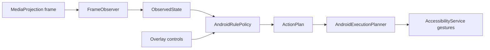

# TFT Hextech Android MVP

This module is a native Android prototype for running the helper directly on Android devices or inside an Android emulator.

It is intentionally separate from the Electron app. The Electron backend cannot be packaged into an APK because it depends on desktop APIs, Node native modules, Windows window capture, and host mouse control.

## Current scope

Implemented in this MVP:

- Permission entry screen.
- MediaProjection foreground service for screen capture.
- AccessibilityService gesture executor.
- Overlay service with Start Dry / Live / Stop controls.
- Minimal `observe -> decide -> plan -> execute` coordinator.
- Shared JSON-like protocol models aligned with the desktop `ObservedState`, `ActionPlan`, and Android execution-step concepts.

Not implemented yet:

- Real TFT OCR / board recognition on Android.
- Full strategy parity with `RuleBasedDecisionEngine.ts`.
- Post-action visual verification.
- Production safety hardening, release signing, or store packaging.

## Build prerequisites

Install Android Studio with:

- JDK 17 or newer.
- Android SDK Platform 35.
- Android SDK Build Tools matching the installed Android Gradle Plugin.

Then open `android-app/` in Android Studio, or run from this directory after Gradle/JDK are available:

```bash
./gradlew assembleDebug
```

On Windows:

```powershell
.\gradlew.bat assembleDebug
```

This repository currently does not include a Gradle wrapper JAR. If Android Studio creates one, commit wrapper files only after verifying they are from the official Gradle distribution.

## Manual test path

1. Install the debug APK on a test Android device or BlueStacks.
2. Open the app.
3. Tap `Request screen capture` and approve the Android recording prompt.
4. Open accessibility settings and enable `TFT Hextech Input Service`.
5. Grant overlay permission.
6. Start the overlay.
7. Use `Start Dry` first. It should report `skipped: vision-not-implemented` until Android OCR is implemented.
8. Do not use `Live` against a real game until OCR and post-action verification are implemented.

## Architecture



## Reuse plan from desktop code

- Keep `ObservedState` / `ActionPlan` protocol compatible with `src-backend/core/types.ts`.
- Port or bundle rule logic only after the Android capture and accessibility loop is stable.
- Port OCR incrementally: stage/HUD first, then shop, then augments/items/board.
- Keep LLM/OpenClaw as a slow advisor later; do not let it directly emit raw tap coordinates.
