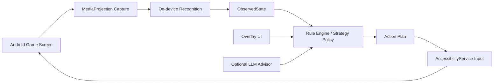

# Android APK Roadmap

## 当前结论

当前优先级已经切到原生 Android APK。短期仍在 BlueStacks 中联调，因为它能快速复现手机权限、录屏、无障碍点击和悬浮窗链路；长期目标是把同一 APK 放到真机上运行。

不能直接把当前 Electron 程序打包成 APK。APK 需要一个原生 Android 执行器，负责截屏、点击、悬浮窗和权限管理；现有规则引擎和数据层可以逐步复用或移植。

## 可复用部分

- `src-backend/core/RuleBasedDecisionEngine.ts`：运营决策逻辑，可通过 JS bundle 复用，或后续移植到 Kotlin。
- `src-backend/data/*`：赛季数据、JinChan season-pack、OCR corrections、名称归一化。
- `src-backend/tft/recognition/RecognitionUtils.ts`：文本归一化、阶段解析、英雄/装备 alias。
- `examples/*` 与 `tests/backend/*`：replay fixture 和策略/OCR 回归样本。

## 需要重写为 Android 原生的部分

- 截屏：使用 `MediaProjection`，替代桌面端 nut-js / ADB screencap。
- 点击/滑动：使用 `AccessibilityService`，替代桌面鼠标和 BlueStacks ADB input。
- 悬浮窗：使用 Android overlay 权限显示状态、暂停按钮、当前决策。
- 权限流程：录屏授权、无障碍授权、悬浮窗授权都必须由用户手动打开。
- 进程保活：前台服务 + 通知栏，避免后台被系统杀掉。

## 推荐架构



## 分阶段计划

### Phase 1: 副屏 BlueStacks 闭环

- 支持副屏窗口坐标，不强制拉回主屏。
- ADB 截图作为主观测路径。
- 输入优先级：ADB input -> 副屏窗口鼠标 -> blocker 诊断。
- 验收：从大厅到排队/进入对局至少能自动推进；局内 `android:auto --dry-run` 能输出计划。

### Phase 2: Android Companion APK 原型

- 建一个最小 Android 项目。
- 实现 `MediaProjection` 截屏并保存帧。
- 实现 `AccessibilityService` 点击固定坐标。
- 不接完整策略，只验证截屏和点击权限链路。

### Phase 3: 移植识别与规则

- 先复用 TypeScript 规则引擎打包成 JS，在 APK 内通过 JS runtime 调用。
- OCR 可以先走模板/轻量识别，复杂 OCR 后置。
- 输出统一的 `ObservedState` JSON，保持和桌面端 replay 兼容。

### Phase 4: 手机独立 MVP

- APK 内完成 `observe -> decide -> execute -> verify`。
- 悬浮窗显示当前阶段、金币、计划动作、暂停按钮。
- 先支持中文界面和固定分辨率，再扩展英文/多分辨率。

## 风险与边界

- 独立 APK 必须依赖用户授权录屏和无障碍服务。
- 不建议让 LLM 直接执行点击。LLM 只作为慢速策略顾问，实时点击仍由规则引擎和安全阈值控制。
- 游戏封号风险无法通过技术完全消除；越接近全自动操作，风险越高。
- 真机厂商后台限制、悬浮窗权限、无障碍服务限制都会影响稳定性。
- 产品成型前只在普通匹配/常规赛训练，不使用排位赛。

## 阵容与版本数据源

- 阵容、英雄、装备或版本节奏出现争议时，优先参考腾讯云顶 GG 官方专题站：https://lol.qq.com/tft/#/index
- 官方站只作为策略和阵容校准来源；落到 APK 前仍需要转换成本地 catalog / 规则配置，并通过普通匹配 live 测试验证。
- 不让 LLM 或外部页面直接输出点击坐标；它们只能影响慢速策略偏好，例如目标阵容、经济底线、是否转阵容。

## 当前落地状态

已新增 `android-app/` 原生 Android MVP 骨架：

- `MainActivity`：权限入口，负责录屏授权、无障碍设置、悬浮窗授权。
- `ScreenCaptureService`：MediaProjection 前台服务，持续发布最新帧。
- `TftAccessibilityService`：通过 Android 无障碍手势执行受控点击。
- `TftOverlayService`：悬浮窗显示状态并提供 `Start Dry` / `Live` / `Stop`。
- `AndroidAutomationCoordinator`：最小 `observe -> decide -> plan -> execute` 循环，默认 dry-run。
- `android-app/protocol/automation-protocol.md`：与桌面端 `ObservedState` / `ActionPlan` 对齐的协议说明。

本机环境已经补齐并通过检查：

- JDK 17
- Android SDK / Platform Tools
- Gradle 8.10.2
- BlueStacks ADB `127.0.0.1:5555`

可先运行：

```bash
npm run android:app:doctor
```

确认 Android Studio/JDK/SDK 安装状态。

当前 APK 已在 BlueStacks 实测：

- 录屏授权、无障碍授权、悬浮窗链路可用。
- `MediaProjection -> ML Kit OCR -> ObservedState -> dry-run plan -> overlay` 可运行。
- 真实局内 HUD 已识别：阶段、金币、等级。
- 真实商店 OCR 已识别：5 个商店槽、费用、部分英雄名。
- 结算页已加 guard：右上排名文字（例如 `第七名`）会触发 `android-result-screen`，强制 `UNKNOWN`，不生成动作。
- live 执行层已有最小 cooldown 和 repeat-limit，但仍未作为稳定功能验收。
- APK 已内置 `assets/tft-season-pack/catalog.json`，启动时加载英雄名、装备名、英雄 OCR alias 和装备 OCR alias；加载失败会回退到内置安全表。
- live 执行层已加入 BUY / ROLL / LEVEL_UP 动作后验证；验证失败会暂停 live 模式。
- 新增 `npm run android:app:catalog -- <ResourcesDir> [outputPath]`，可从 JinChan `Resources/` 生成 APK catalog，字段包括 `champions`、`equipment`、`championAliases`、`equipmentAliases`，并保留旧 `aliases` 兼容字段。
- Android Item OCR MVP 已接入文字路径：当装备选择/说明弹窗出现可读装备名时，ML Kit 文本 OCR 会输出到 `ObservedState.items`。
- 图标-only 装备识别已完成基础层并接入观测链：APK catalog 支持从 `EquipmentImages/` 自动生成 `equipmentIconSignatures`，Kotlin 侧已有 8x8 图标签名生成、Hamming 距离匹配和可配置 `AndroidEquipmentIconRecognizer`；`MlKitHudFrameObserver` 已把保守 icon crops 与文字 OCR 结果合并到 `ObservedState.items`。真实棋盘/备战席定位仍需继续校准。
- Overlay 已显示 icon-only 诊断行：`icons=<命中数量> <命中装备名>`，用于区分 crop 未命中和模板签名未匹配。
- 新增 `npm run android:app:items -- <screenshot> [catalog]`，可离线输出每个装备 crop 的签名和匹配结果，用于真实对局截图回放校准。
- `npm run android:app:items -- --scan <screenshot> [catalog]` 可对整张截图做粗网格搜索，用于在 crop 坐标未知时找候选装备图标位置。
- `--scan` 输出包含可复制的归一化 `crop`，并支持 `--max-distance`、`--max-results` 辅助早期校准。
- `--scan` 同时输出 `kotlinCrop`，可直接复制到 APK 的 `itemIconCrops` 候选列表中。
- `--write-crops <dir>` 可把 scan 命中的候选裁片落盘，人工确认后再把 `kotlinCrop` 提升为正式 APK crop，避免把结算页 UI 或装饰误加到识别链。

## 当前下一步

继续扩展 Android OCR 和规则策略输入：

- 把英雄名纠错从临时内置表迁移到 season-pack / CorrectionsList 数据。
- 扩展 APK season-pack：用真实完整 JinChan `Resources/` 生成 catalog，并把羁绊字段接入后续策略层。
- 校准装备图标 crop：用真实局内截图调整棋子身上/备战席 item icon 坐标，降低漏识别和误识别。
- 增加更细的动作后验证：BUY 后检查具体商店槽/备战席变化，ROLL 后检查刷新按钮 cooldown，LEVEL_UP 后检查 XP 环。
- live 模式继续保持受控测试，不做无人值守连续点击。
